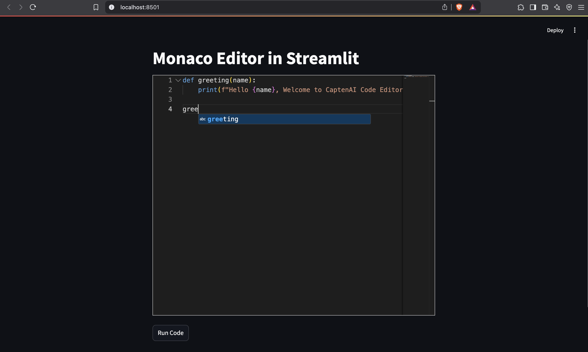
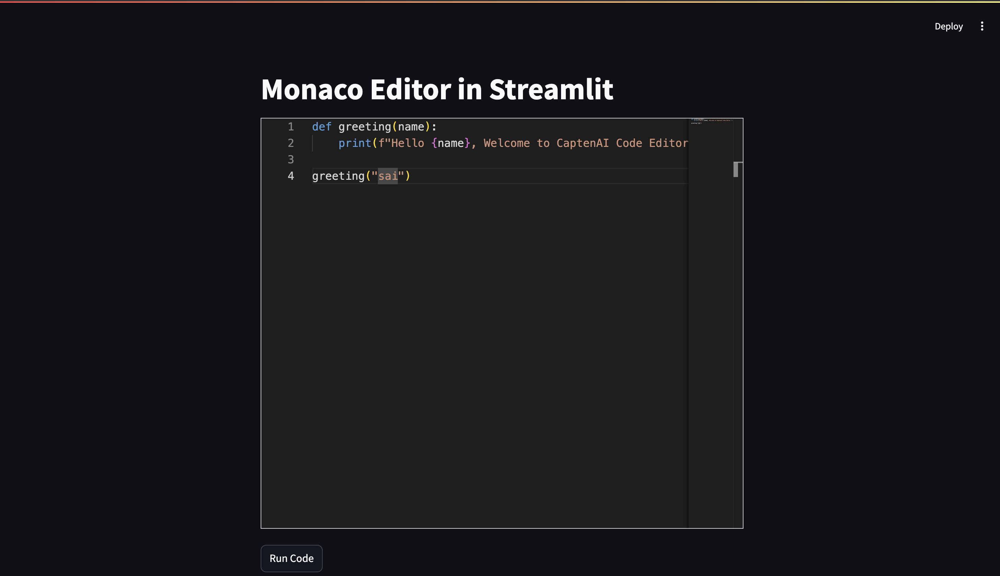
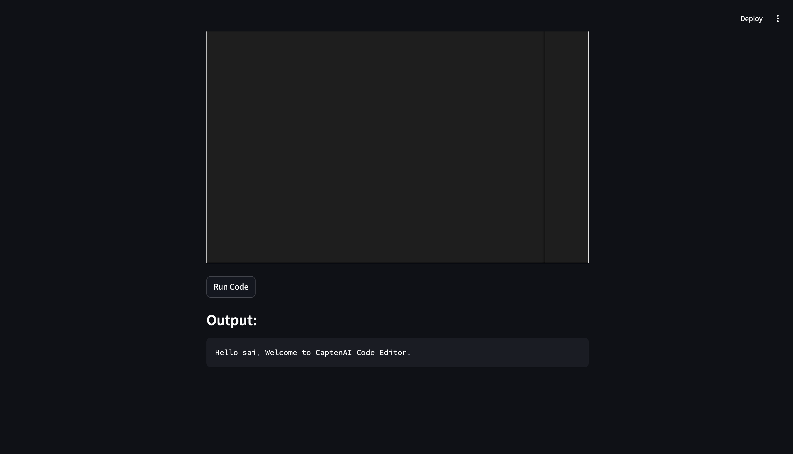

# 🧠 Streamlit Monaco Editor Component

This project is a **custom Streamlit component** that embeds the powerful **Monaco Editor** (the same editor used by VS Code) into your Streamlit apps. It allows users to write, edit, and return code interactively within Streamlit using a modern, feature-rich code editor.

---

## 🚀 Features

- Full integration with [Monaco Editor](https://microsoft.github.io/monaco-editor/)
- Supports multiple languages (e.g. JavaScript, Python, SQL)
- Sends typed code back to Streamlit in real-time
- Configurable:
  - Theme (`vs-dark` / `vs-light`)
  - Font size
  - Initial value
  - Language
  - Editor height

---

## 📦 Project Structure

```
component-template/
│
├── template/
│   └── my_component/
│       ├── __init__.py       # Python wrapper
│       ├── example.py        # Demo Streamlit app
│       └── frontend/
│           ├── src/
│           │   ├── MyComponent.tsx   # React + Monaco code
│           │   └── index.tsx         # Entry point
│           ├── public/               # Static HTML
│           ├── package.json
│           └── tsconfig.json
```

---

## ⚙️ Installation & Setup

### 1. Clone and Install
```bash
git clone <your-repo-url>
cd component-template/template/my_component/frontend
npm install
```

### 2. Run React Dev Server (during development)
```bash
npm start
```
This will launch the Monaco editor frontend on `http://localhost:3000`

### 3. Run Streamlit App
Open a new terminal:
```bash
cd component-template/template
streamlit run my_component/example.py
```
Visit: `http://localhost:8501`

---

## 🎓 How It Works

- Streamlit loads your custom component inside an **iframe**
- Communication between Streamlit and the Monaco editor uses `postMessage()` internally
- Use `Streamlit.setComponentValue()` in React to send code back to Python
- Use `Streamlit.setComponentReady()` to signal the component is ready

---

## 🌟 Customization

You can customize the editor by passing arguments from Python:
```python
monaco_editor(
    default_value="print('Hello')",
    language="python",
    height=500,
    font_size=16,
    key="editor"
)
```

---
## Screenshots

  
   
  

---

## 💌 **Contact & Support**
If you have any questions, feel free to reach out:

📧 Email: venkatasaiancha24@gmail.com  
💻 LinkedIn: https://www.linkedin.com/in/venkatasaiancha/  
📂 GitHub: https://github.com/avsai24  
